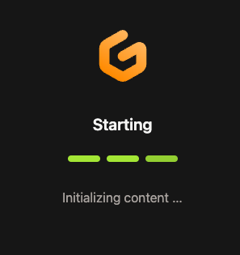
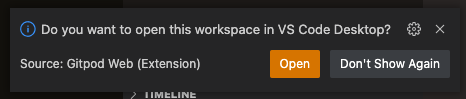
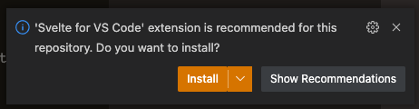
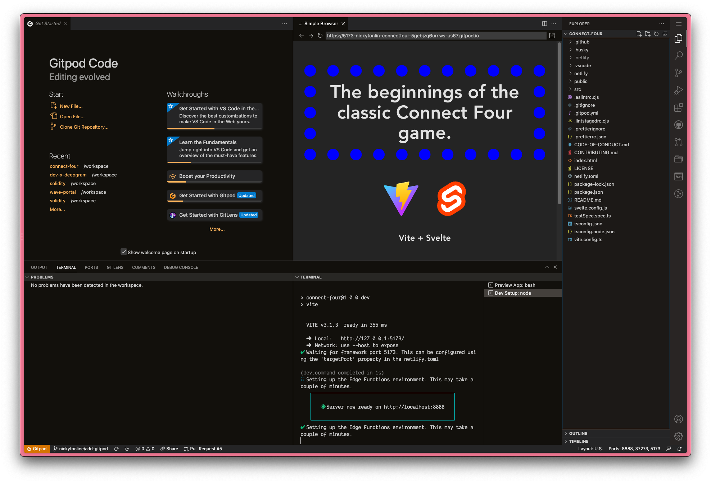
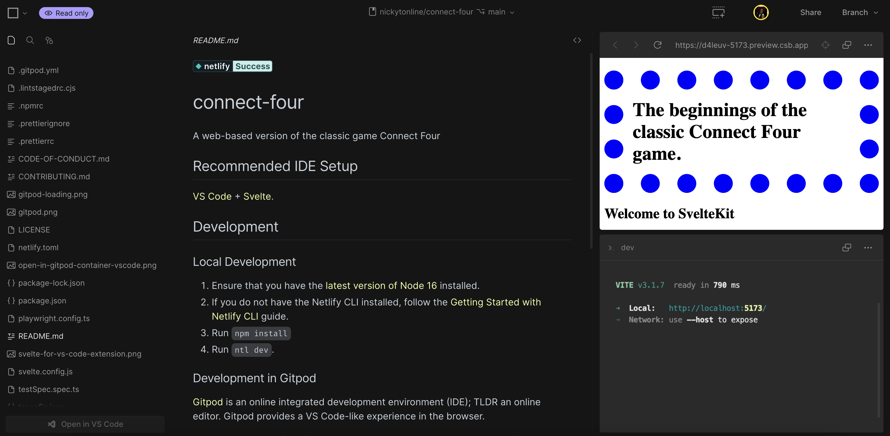
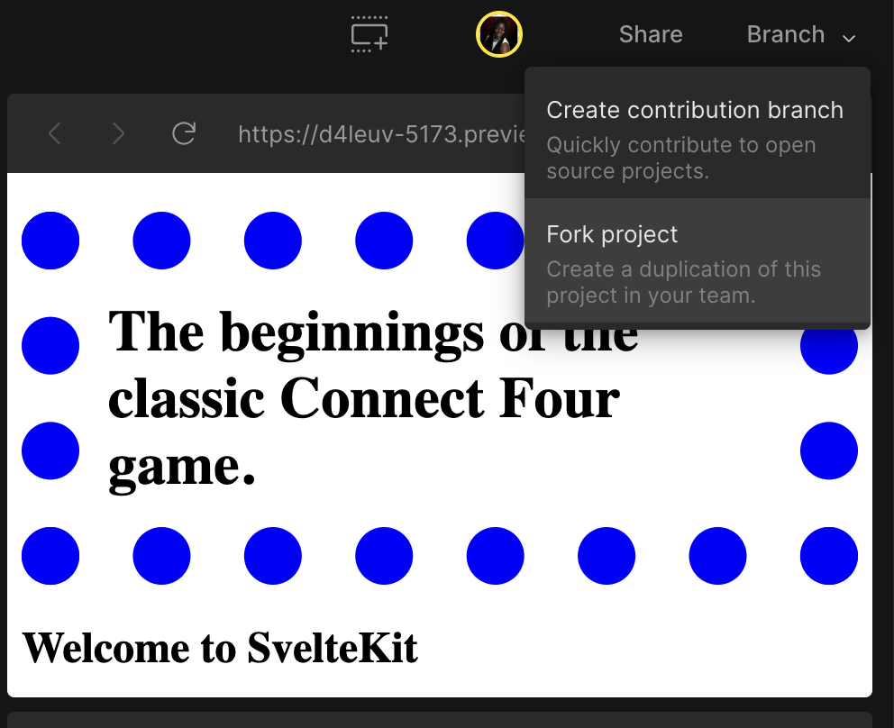
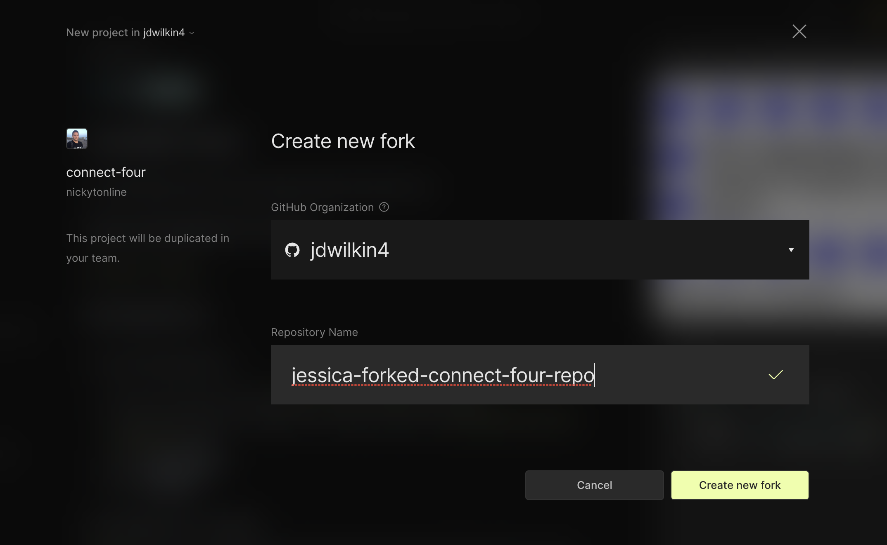
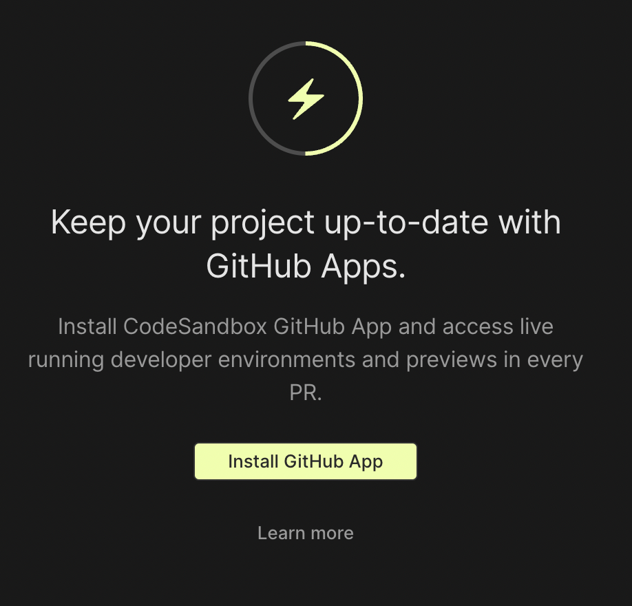
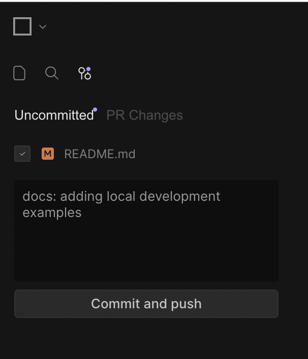

# connect-four

A web-based version of the classic game Connect Four.

Connect Four is a two-player connection board game. It is also known as Connect 4, Four Up, Plot Four, Find Four, Captain's Mistress, Four in a Row, Drop Four, and Gravitrips in the former Soviet Union.

Players choose a colour and then take turns dropping coloured tokens into a seven-column, six-row, vertically suspended grid. The pieces fall straight down, occupying the lowest available space within the column.

The game's objective is to be the first to form a horizontal, vertical, or diagonal line of four of one's own tokens. Connect Four is a solved game. The first player can always win by playing the right moves. Connect Four is a two-player game with perfect information for both sides, meaning that nothing is hidden from anyone. Connect Four also belongs to an adversarial, zero-sum game classification since a player's advantage is an opponent's disadvantage.

Reference [Connect Four on Wikipedia](https://en.wikipedia.org/wiki/Connect_Four)

## Contributing

If you're interested in contributing to the project, please read the
[contributing guidelines](CONTRIBUTING.md).

## Recommended IDE Setup

[VS Code](https://code.visualstudio.com/) +
[Svelte](https://marketplace.visualstudio.com/items?itemName=svelte.svelte-vscode).

## Development

### Local Development

1. Ensure that you have the [latest version of Node 16](https://nodejs.org/en/download/) installed.
1. If you do not have the Netlify CLI installed, follow the
   [Getting Started with Netlify CLI](https://docs.netlify.com/cli/get-started/) guide.
1. Run `npm install`
1. Run `ntl dev`.

### How to work with Storybook?

1. Run the app with  `npm run storybook`
2. How to build it by running? - `npm run build-storybook`
3. Story Book Official documentation
- [Guides](https://storybook.js.org/docs/react/get-started/introduction)

- [Tutorials](https://storybook.js.org/tutorials/)

### Development in Gitpod

[Gitpod](https://gitpod.io) is an online integrated development environment (IDE); TLDR an online
editor. Gitpod provides a VS Code-like experience in the browser.

To load the project, first fork this project to your own account, and then from the fork, e.g.
https://github.com/some-user/connect-four, you can load it in Gitpod by prepending the URL with
`https://gitpod.io/#`, e.g. `https://gitpod.io/#https://github.com/some-user/connect-four`

It'll take a minute to load up.

Gitpod will prompt to open in VS Code. Click the X in the top right of the prompt.

Gitpod will prompt you to install the Svelte for VS Code extension. Click the Install button.

It
will install all npm packages for the project. Once all the dependencies are installed, it will load
the project by running `ntl dev` and the app will appear in development mode.

From there, you can start developing like you would if working on your local machine's IDE.

## Development in CodeSandbox

[CodeSandbox](https://codesandbox.io/) is a popular online code editor that works well for creating small web applications. You can use CodeSandBox right in the browser while you work on your code contributions to the `connect-four` repository.

To get started, you will need to sign in or signup for a [CodeSandbox](https://codesandbox.io/) account. Once you are logged in, go to the [connect-four CodeSandbox repo URL](https://codesandbox.io/p/github/nickytonline/connect-four/main?file=%2FREADME.md).

You should see a complete list of files, a README and the preview window.

In the upper right hand corner, click on the Branch dropdown and choose the "Fork project" option. This will create your own copy of the `connect-four` repository on CodeSandbox.

You will then be asked to create a name for your forked repository.

When you click on the "Create new fork" button, it will create a new forked copy of the `connect-four` repository. From there, you can create a new branch by clicking on the Branch button in the upper right hand corner to start working on contributing to the repo.

You might also see a message like this to install GitHub Apps which helps you run your development server on CodeSandbox.

Once you make some changes, you can commit and push up your work and create a PR by using the Git tools located in the left hand corner of the screen.

